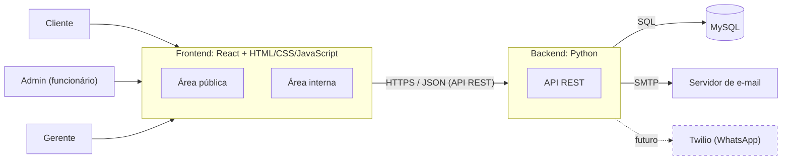
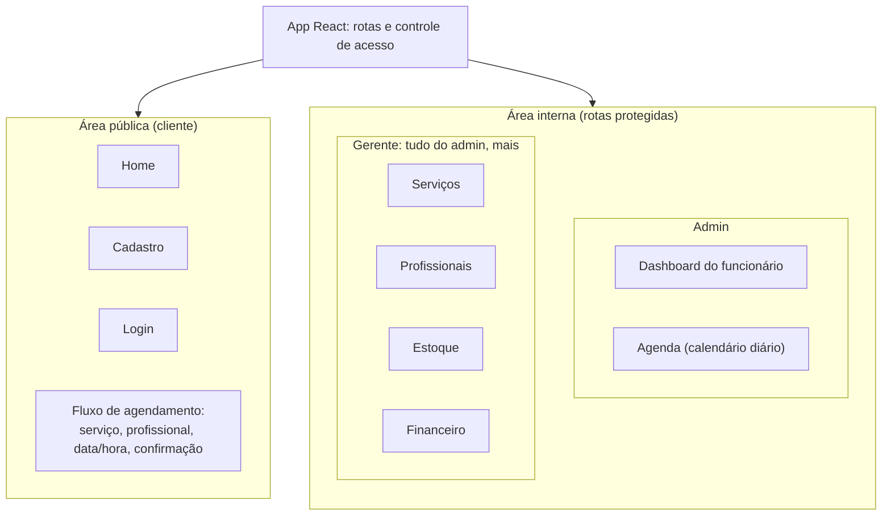
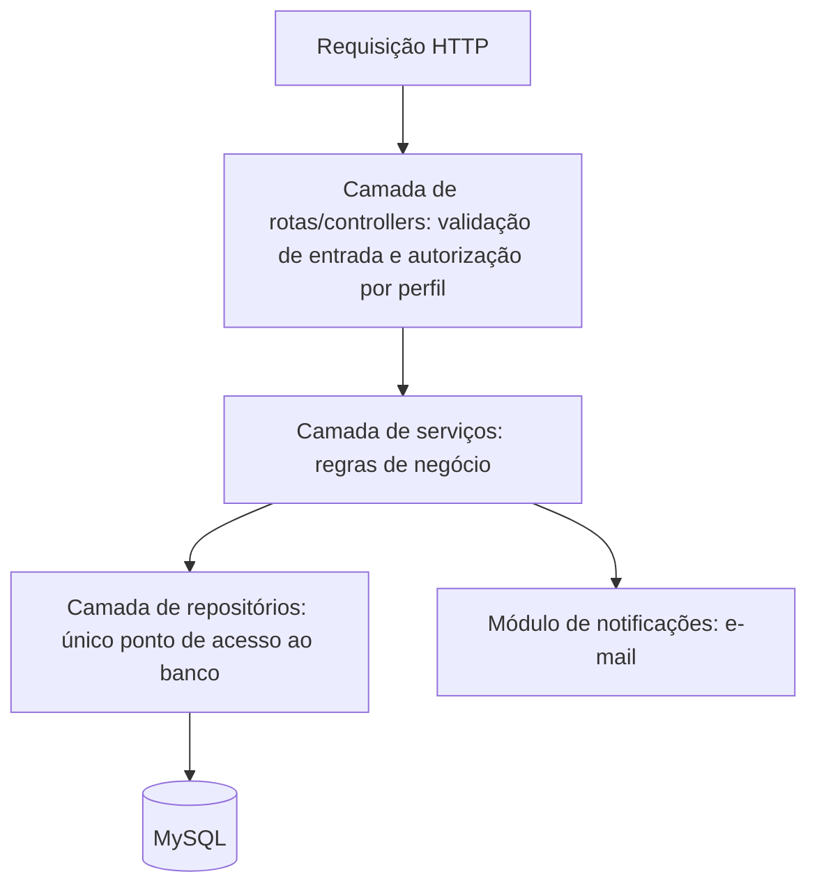
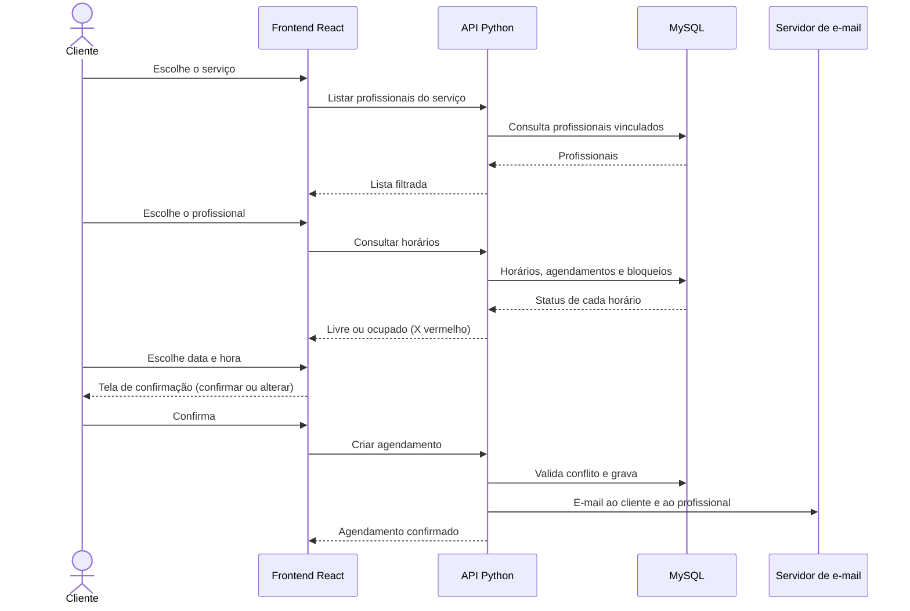
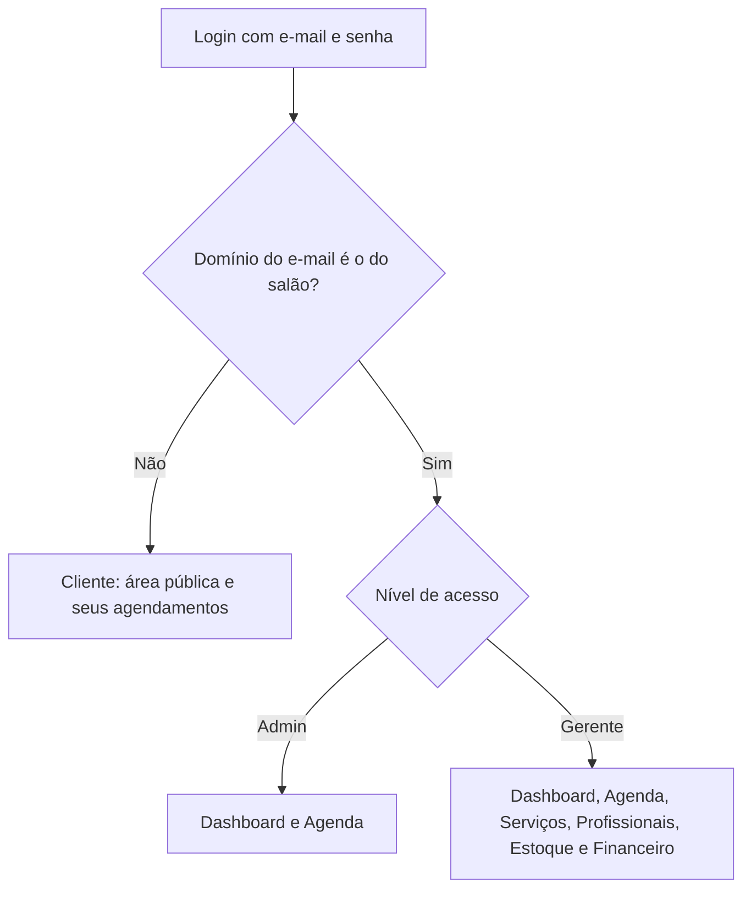

# Arquitetura do Sistema — Time 12
## Sistema de Agendamento e Gestão para Salão de Beleza

Este documento descreve a arquitetura planejada e serve de base para a Seção 10 (Arquitetura e Tecnologias) do relatório `Time 12.docx`.

---

## 1. Visão geral (contexto do sistema)

O sistema tem duas superfícies, uma área pública para o cliente e uma área interna para o admin (funcionário) e o gerente. As duas conversam com a mesma API em Python, que acessa um banco MySQL.



A linha tracejada indica a integração futura com WhatsApp via Twilio. Ela está prevista apenas em Trabalhos Futuros (Seção 15) e não é um compromisso de sprint.

---

## 2. Frontend (React)



- **Home:** presente na área pública, mas ainda sem tarefa no backlog.
- **Rotas protegidas:** o React verifica o nível de acesso (cliente, admin ou gerente) antes de exibir cada tela. A validação real fica sempre no backend.
- **Menu lateral:** varia por perfil. O admin vê Dashboard e Agenda. O gerente vê esses dois e também Serviços, Profissionais, Estoque e Financeiro.

---

## 3. Backend (Python) em camadas

O backend segue o padrão em camadas com *Repository pattern*, para que a regra de negócio nunca acesse o banco diretamente.



| Camada | Responsabilidade | Exemplo neste projeto |
|---|---|---|
| Rotas/controllers | Receber a requisição, validar os dados e checar o nível de acesso | Rota de criar agendamento só aceita usuário autenticado |
| Serviços | Aplicar as regras de negócio | Impedir agendamento em horário ocupado ou bloqueado |
| Repositórios | Executar as consultas SQL | Buscar horários livres de um profissional |
| Notificações | Enviar e-mails | Confirmação ao cliente e ao admin/profissional |

### Módulos do backend

| Módulo | Função |
|---|---|
| Autenticação e acesso | Cadastro, login por e-mail e senha, redirecionamento por domínio do salão, três níveis de acesso |
| Serviços e profissionais | CRUD, vínculo profissional↔serviço, horário de trabalho, nível de acesso |
| Agendamentos | Listar horários (livre/ocupado), criar agendamento, excluir para liberar o horário |
| Bloqueios | Bloquear e desbloquear horários do profissional |
| Estoque | CRUD de produtos e alerta de estoque baixo |
| Financeiro e BI | Faturamento por semana/mês/ano, ranking de funcionários, serviços mais realizados, comparativo mensal |
| Notificações | E-mail de confirmação (data, hora, endereço do salão, nome do profissional) |

---

## 4. Fluxo principal: agendamento do cliente



---

## 5. Controle de acesso



---

## 6. Tecnologias

| Camada | Tecnologia | Observação |
|---|---|---|
| Frontend | React, HTML, CSS e JavaScript | Gráficos do Dashboard e do Financeiro via biblioteca de gráficos (a definir) |
| Protótipos | Figma/XD | Print no relatório, mais o link |
| Backend | Python + Flask | Login por token assinado (itsdangerous); camadas rota → serviço → repositório |
| Banco de dados | MySQL 8 | Modelo relacional em `docs/mer.md`; migrations em SQL puro |
| E-mail | SMTP | Notificações de confirmação |
| WhatsApp | Twilio | Apenas Trabalhos Futuros |
| Versionamento | GitHub (organização PI-6) | `main` ← `developer` ← `feature/{n-issue}-{nome}` |
| Gestão | GitHub Projects (Kanban) e Scrum | Seis sprints de duas semanas |
| Hospedagem/cloud | A definir | Ainda sem decisão registrada |

---

## 7. Estrutura de pastas sugerida do repositório

```
/
├── frontend/              # React
│   └── src/
│       ├── pages/         # home, cadastro, login, agendamento, admin, gerente
│       ├── components/    # botões, inputs, cards, gráficos
│       └── routes/        # rotas protegidas por perfil
├── backend/               # Python
│   ├── routes/            # controllers
│   ├── services/          # regras de negócio
│   ├── repositories/      # acesso ao banco
│   └── notifications/     # e-mail
├── database/              # migrations e seeds
├── docs/                  # documentação
├── CONTRIBUTING.md
└── README.md
```

---

## 8. Pontos em aberto

- Biblioteca de gráficos do frontend. (Backend: Flask, definido.)
- Hospedagem/cloud, citada na Sprint 0, ainda sem decisão.
- Tarefas da página Home, que ainda não estão no backlog.
