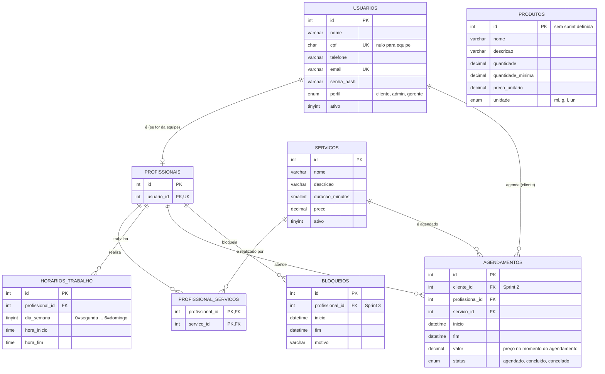

# Modelo de Dados (MER) — Time 12

Proposta inicial do modelo relacional, feita a partir de `docs/requisitos.md` e `docs/sprints.md`.
**Precisa da revisão do Eduardo** antes de ser considerada final (Seção 9 do relatório).

Convenções:
- Tabelas e colunas em português, no singular para colunas e plural para tabelas.
- Toda tabela tem `id` inteiro auto incremento como chave primária.
- Exclusões de usuários e serviços são lógicas (`ativo = 0`), para não perder o histórico
  de agendamentos usado pelo BI.

## Diagrama

As tabelas marcadas como *(Sprint N)* ainda não têm migration; entram quando a sprint começar.

## Decisões e justificativas

| Decisão | Por quê |
|---|---|
| Profissional é um usuário com perfil `admin` ou `gerente` + linha em `profissionais` | O RF08 diz que o gerente define o nível de acesso do profissional, então todo profissional faz login. A tabela separada garante que um agendamento só aponte para quem é da equipe. |
| Perfil como `ENUM` em `usuarios` | São só três perfis fixos e o gerente herda o admin; uma tabela de papéis seria complexidade sem ganho agora. |
| CPF e telefone só com dígitos e opcionais | Obrigatórios no cadastro do cliente (validado na API), mas funcionários podem ser cadastrados só com nome e e-mail. São dados pessoais (LGPD). |
| Um intervalo de trabalho por dia | Pausas (almoço, consulta médica) são feitas com `bloqueios`, como descrito na Sprint 3. |
| `agendamentos.valor` guarda o preço do dia | Se o preço do serviço mudar, a receita histórica do BI continua correta. |
| `agendamentos.status` em vez de apagar a linha | Excluir um agendamento libera o horário (RF06), mas manter a linha como `cancelado` ajuda nos relatórios. A regra exata fica para a Sprint 2/3. |

## Pontos para o Eduardo revisar

1. Estoque (RF09) não aparece em nenhuma sprint do `docs/sprints.md`. Em qual sprint entra?
2. Agendamento cancelado: apagar a linha ou mudar o status? (impacta o BI)
3. Precisamos de índice em `agendamentos (profissional_id, inicio)` na Sprint 2 (tarefa de otimização).
